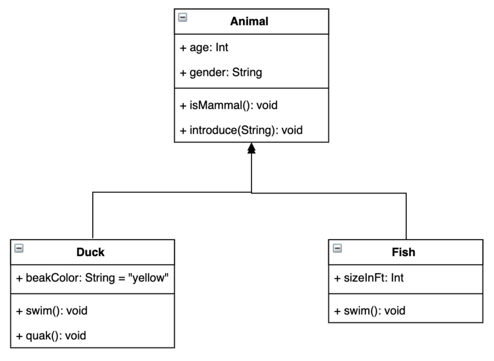

# 5장 유사한 코드 융합하기

- 유사 클래스 통합하기
- 조건부 산술로 구조 노출하기
- 간단한 UML 클래스 다이어그램 이해하기
- 전략 패턴의 도입으로 유사 코드 통합하기
- 구현체가 하나분인 인터페이스를 만들지 말 것으로 어지러움 정리하기

### 1. 유사한 클래스 통합하기

#### 리팩터링 패턴1: 유사 클래스 통합

- 상수 메서드를 공통으로 가진 두개 이상의 클래스에서 일련의 상수 메서드가 클래스에따라 다른 값을 반환할 때 클래스를 통합할 수 있음
- 일련의 상수 메서드 = 기준(basis)

**절차**
[연습코드](https://github.com/suyeoniii/five-lines-study/commit/95e4809a2ce2af671279f2c97fbd801b6e85d89b)

1. 비기준 메서드 **동일**하게 만들기
   1. 메서드 본문 기존 코드 주위에 **if(true) {}** 추가하기
   2. true를 모든 기본 메서드를 호출하여, 결과를 상수 값과 비교하는 표현식으로 변경
   3. 각 버전의 본문을 복사하고 else와 함께 다른 모든 버전에 붙여넣기
2. 기준 메서드만 다르므로, 기준메서드에 각 메서드의 필드를 도입하고 **생성자**에서 상수를 할당함
3. 상수 대신 도입한 필드를 반환하도록 메서드 변경
4. 문제가 없는지 확인하기 위해 컴파일
5. 클래스에 대해 한 필드씩 다음을 수행
   1. 필드의 기본값을 매개변수로 지정
   2. 컴파일러 오류를 살펴보고 기본값을 **인자**로 전달
6. 모든 클래스가 동일하면 통합한 클래스 중 **하나를 제외한 모두를 삭제**하고, 삭제하지 않은 클래스로 바꾸어 컴파일러 오류 수정

##### 💡 Typescript Tip

1. 생성자는 하나만 가질 수 있으며, constructor라는 명칭 사용
2. 생성자의 매개변수 앞에 public 또는 private 키워드를 넣으면 자동으로 인스턴스 변수를 만들고 인자의 값을 할당함

```ts
// 변경전
class Stone implements Tile {
  private falling: boolean;
  constructor(falling: boolean) {
    this.falling = falling;
  }
}

// 변경후
class Stone implements Tile {
  constructor(private falling: boolean) {}
}
```

#### 열거형으로 타입 노출

명명되지 않은 부울 인자를 제거하여 코드 가독성 증가
`변경전`

```ts
new Stone(true);
```

`변경후`

```ts
enum FallingState {
  FALLING,
  RESTING,
}
new Stone(FallingState.FALLING);
```

#### 클래스로의 타입코드 대체

`변경전`

```ts
enum FallingState {
  FALLING,
  RESTING,
}
```

`변경후`

```ts
interface FallingState {
  isFalling(): boolean;
  isResting(): boolean;
}
class Falling implements FallingState {
  isFalling() {
    return true;
  }
  isResting() {
    return false;
  }
}
class Resting implements FallingState {
  isFalling() {
    return false;
  }
  isResting() {
    return true;
  }
}
...
new Stone(new Falling())
new Stone(new Resting())
```

#### 클래스로의 코드 이관

**if 문에 else를 사용하지 말 것 규칙** 적용
`변경전`

```ts
class Stone implements Tile {
  moveHorizontal(dx: number) {
    if (!this.falling.isFalling()) {
        ...
    } else if (this.falling.isFalling()) {
    }
  }
}
```

`변경후`

```ts
interface FallingState {
  isFalling(): boolean;
  moveHorizontal(tile: Tile, dx: number): void;
}

class Falling implements FallingState {
  isFalling() {
    return true;
  }
  moveHorizontal(tile: Tile, dx: number) {}
}

class Resting implements FallingState {
  isFalling() {
    return false;
  }
  moveHorizontal(tile: Tile, dx: number) {
    ...
  }
}
```

### 2. 단순한 조건 통합하기

#### 리팩터링 패턴2: if 문 결합

- 내용이 동일한 연속적인 if 문을 결합해서 중복을 제거함
- `||`를 추가해서 연속된 if문 결합

[Falling() 도우미 메서드 만들기 연습코드](https://github.com/suyeoniii/five-lines-study/commit/0cf785c3a9b031974707bea523715619c086c30a)

### 3. 복잡한 조건 통합하기

#### 규칙: 순수 조건 사용

- 조건에 부수적인 동작이 없어야함
- 부수적인 동작 = 조건이 변수에 값을 할당, 예외 발생, 출력, 파일 쓰기 등

부수적인 동작에서 반환을 분리할 수 없는 경우 캐시 사용

##### 범용 캐시

```ts
class Cacher<t> {
  private data: T;
  constructor(private mutator: () => T) {
    this.data = this.mutator();
  }
  get() {
    return this.data;
  }
  next() {
    this.data = this.mutator();
  }
}

let tmpBr = new Reader();
let br = new Cacher(() => tmpBr.readLine());
for (; br.get() !== null; br.next()) {
  let line = br.get();
  console.log(line);
}
```

#### 조건 산술 적용

코드를 수학 방정식으로 변환하고 단순화한 후 다시 코드로 바꾸기

### 4. 클래스 간의 코드 통합

#### UML 클래스 다이어그램

UML (Unified Modeling Language)

- 전략패턴은 클래스 다이어그램을 사용해 보여짐

클래스 다이어그램

- 인터페이스와 클래스의 구조가 서로 어떤 관계가 있는지 보여줌
- 메서드와 필드를 public(+), private(-)와 표시




#### 리팩터링 패턴3: 전략패턴의 도입

다른 클래스를 인스턴스화해서 변형을 도입하는 개념을 전략패턴이라고 함

[연습코드](https://github.com/suyeoniii/five-lines-study/commit/96286d8de413793c1993b5ecf4eb06289fe7e33e)

**절차**

1. 분리하려는 코드에 **메서드 추출** 진행
2. **새로운 클래스** 생성
3. 생성자에서 새로운 클래스를 **인스턴스화**
4. 매서드를 새로운 클래스로 옮김
5. 필드에 **종속성**이 있는 경우 다음 수행
   1. 필드를 새로운 클래스로 옮기고 옮긴 필드에 대한 접근자 생성
   2. 새로운 접근자를 사용해서 원래 클래스에서 발생하는 오류를 바로 잡음
6. 새로운 클래스의 나머지 오류 해결을 위해 매개변수 추가
7. **메서드의 인라인화**로 1단계 추출을 반대로 수행

#### 규칙: 구현체가 하나뿐인 인터페이스를 만들지 말 것

- 불필요한 일반화
- 가독성 떨어짐
- 수정 시 오버헤드 발생

#### 리팩터링 패턴: 구현에서 인터페이스 추출

> 처음부터 인터페이스를 만들지 않고, 필요하면 구현에서 인터페이스를 추출하는 방법

1. 추출할 클래스와 동일한 이름으로 새로운 인터페이스 생성
2. 인터페이스를 추출할 클래스 이름 변경, 새로운 인터페이스 구현
3. 컴파일, 오류 검토
   1. new때문에 오류 발생 시 새로운 클래스의 이름으로 변경
   2. 오류를 잃으키는 메서드를 인터페이스에 추가

### 5. 유사 함수 통합하기

[연습코드](https://github.com/suyeoniii/five-lines-study/commit/1046e4f7dc0fd3f805f827dcbc38782e67ba4031)

1. 전략패턴 도입
2. 구현에서 인터페이스 추출

### 6. 유사한 코드 통합하기

[연습코드](https://github.com/suyeoniii/five-lines-study/commit/e559e7db215c510bbdd7fdfdfb44c5a522602357)

1. 유사 클래스 통합
2. 전략패턴의 도입

### 요약

- 모아야할 코드가 있을 때 통합
  - 유사 클래스 통합
  - if문 결합
  - 전략패턴의 도입
- 순수 조건 사용
- UML 클래스 다이어그램은 일반적으로 코드베이스에 특정 아키텍처의 변경을 설명하기위해 사용
- 구현체가 하나뿐인 인터페이스를 만들지 말 것
  - 구현에서 인터페이스 추출
